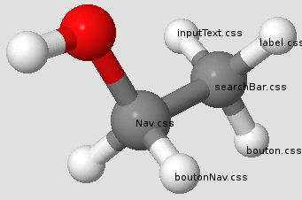

# Atomic Design

## L'Atomic Design ?! Keksako ??

En résumé, c'est super-simple: Brad Frost et Dave Olsen, les gars qui sont derrières ce concept, l'appellent **"Construire des éléments, pas des pages".** - Donc ne PLUS concevoir et développer des pages complètes mais concevoir et développer de petits éléments. Des éléments **vraiment petits**, comme un bouton d'une barre de recherche. Le bouton, c'est un atôme.  Si vous combinez cet atôme avec d'autres atômes, comme un input de saisie et son label, et vous obtenez une barre de recherche soit une molécule. Ensuite, si vous combinez cette molécule à d'autres molécules, comme un menu de navigation et un formulaire de contact :) et vous obtenez un organisme... enfin voilà, vous avez saisi l'idée. Cet un concept relativement récent pour ceux qui font du Frontend mais les codeurs en backend connaissent déjà bien ce concept puisqu'on pourrait la comparer une Progarmation Orienté Objet (POO).

`
- atoms
  - _buttons.scss
  - _links.scss
  - _inputs.scss
- molecules
  - _navigation.scss
  - _search-form.scss
  - _contact-form.scss
- organisms
  - _header.scss
  - _footer.scss
  - _content.scss
- templates
  - _sticky-footer.scss
  - _grid-2column.scss
  - _grid-3column.scss
- pages
  - _home.scss
  - _about.scss
  - _contact.scss
`

## 5 bonnes raisons d'adopter l'Atomic Design 

1. Réutilisabilitable
2. Mise en page facile à comprendre
3. Processus plus efficace, prototypage plus rapide
4. Structure de fichier plus modulaire
5. Plus facile à mettre à jour et à supprimer des parties du site

## le SCSS ou le SASS 
